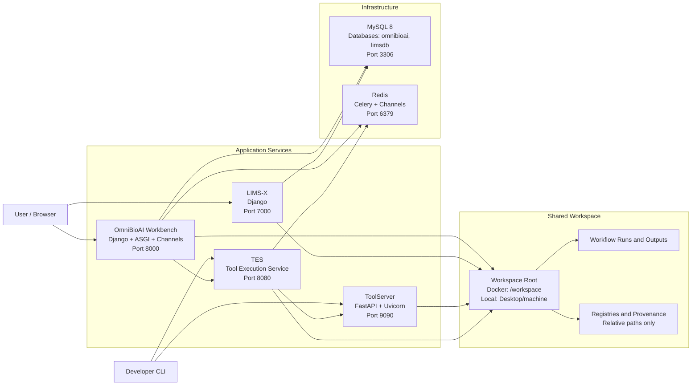

# OmniBioAI Local Development Workspace

This repository defines a **local development workspace and orchestration layer** for the **OmniBioAI ecosystem**, including workflow execution, tool services, LIMS integration, and AI-driven bioinformatics applications.

All services are designed to run **locally**, **without mandatory cloud dependencies**, using a shared workspace layout and reproducible startup mechanisms.

> **Important**
>
> This repository does **not** vendor or embed application source code.
> Each major component lives in its **own GitHub repository** and is referenced here explicitly.

---

## Workspace Layout

```
Desktop/machine/
├── omnibioai/                 # OmniBioAI Workbench (Django)
├── omnibioai-tool-exec/       # TES – Tool Execution Service
├── omnibioai-toolserver/      # FastAPI ToolServer (Enrichr, BLAST, etc.)
├── lims-x/                    # LIMS-X (Laboratory Information Management)
├── ragbio/                    # RAG-based Bioinformatics Assistant
├── utils/
│   └── kill_port.sh           # Utility to free busy ports
├── smoke_test_stack.sh        # Health checks for the full stack
├── start_stack_tmux.sh        # One-command stack launcher (tmux)
├── db-init/                   # MySQL init dumps (omnibioai + limsdb)
│   ├── omnibioai.sql
│   └── limsdb.sql
├── docker-compose.yml         # Full local stack (Docker Compose)
├── .env.example               # Environment variable template
├── backup/                    # Archived / experimental work
└── ai-dev-docker/             # Docker experiments (optional)
```

---

## Architecture



---

## Canonical Repositories

Each service must be cloned independently:

| Component                        | Repository                                                                                         |
| -------------------------------- | -------------------------------------------------------------------------------------------------- |
| **OmniBioAI Workbench**          | [https://github.com/man4ish/omnibioai](https://github.com/man4ish/omnibioai)                       |
| **Tool Execution Service (TES)** | [https://github.com/man4ish/omnibioai-tool-exec](https://github.com/man4ish/omnibioai-tool-exec)   |
| **ToolServer**                   | [https://github.com/man4ish/omnibioai-toolserver](https://github.com/man4ish/omnibioai-toolserver) |
| **LIMS-X**                       | [https://github.com/man4ish/lims-x](https://github.com/man4ish/lims-x)                             |
| **RAGBio**                       | [https://github.com/man4ish/ragbio](https://github.com/man4ish/ragbio)                             |

This repository **only orchestrates** these projects.

---

## Design Principles

* **Single workspace root**
* **Relative paths only**
* **No hardcoded absolute paths**
* **Service isolation via ports**
* **Restart-safe startup**
* **Docker ↔ non-Docker parity**

This makes the workspace:

* Portable across machines
* Safe to rename or relocate
* Suitable for Docker, HPC, or VM environments
* Stable for long-running research workflows

---

## Services & Ports

| Service             | Default Port | Description                |
| ------------------- | ------------ | -------------------------- |
| OmniBioAI Workbench | 8000         | Django UI, plugins, agents |
| TES                 | 8080         | Workflow & tool execution  |
| ToolServer          | 9090         | FastAPI tool APIs          |
| LIMS-X              | 7000         | LIMS integration           |
| MySQL               | 3306         | omnibioai + limsdb         |
| Redis               | 6379         | Celery, Channels           |

All ports are configurable via `.env`.

---

## Environment Configuration

Copy the template:

```bash
cp .env.example .env
```

Edit values as needed (ports, secrets, database credentials).

---

## Docker-Based Workflow (Recommended)

### 1. Build All Images

From the workspace root:

```bash
docker compose build
```

Each service builds from its **own repo-local Dockerfile**.

> ⚠️ **Note**
> Ensure large data directories (e.g. `data/`, `mlruns/`, `results/`) are excluded via `.dockerignore` in each repo to avoid multi-GB build contexts.

---

### 2. Export Existing Databases (One-Time)

```bash
mysqldump -u root -p omnibioai > db-init/omnibioai.sql
mysqldump -u root -p limsdb > db-init/limsdb.sql
```

These dumps are automatically imported by MySQL **on first startup**.

---

### 3. Start the Full Stack

```bash
docker compose up
```

Or clean rebuild:

```bash
docker compose down -v
docker compose up --build
```

---

### 4. Verify Health

```bash
curl http://localhost:9090/health
curl http://localhost:8080/health
curl http://localhost:8000/
curl http://localhost:7000/
```

---

## One-Command Startup (Non-Docker)

```bash
bash start_stack_tmux.sh
tmux attach -t omnibioai
```

Ideal for fast local iteration without containers.

---

## Path Handling Policy (Critical)

All persisted paths **must be relative** to the workspace root.

✅ Correct:

```json
{ "path": "omnibioai/work/results/run_001" }
```

❌ Incorrect:

```json
{ "path": "/home/manish/Desktop/machine/omnibioai/..." }
```

This ensures Docker, HPC, and rename safety.

---

## Database Model

| Database    | Used By             |
| ----------- | ------------------- |
| `omnibioai` | OmniBioAI Workbench |
| `limsdb`    | LIMS-X              |

Single MySQL container, multiple logical databases.

---

## Quick Debug Commands

```bash
docker compose logs -f omnibioai
docker compose logs -f mysql
lsof -i :8000 :8080 :9090 :7000
```

---

## Status

✅ Clean workspace
✅ Docker + non-Docker parity
✅ Multi-database MySQL
✅ No absolute paths
✅ Production-leaning architecture

This repository acts as the **local control plane** for the OmniBioAI ecosystem.

